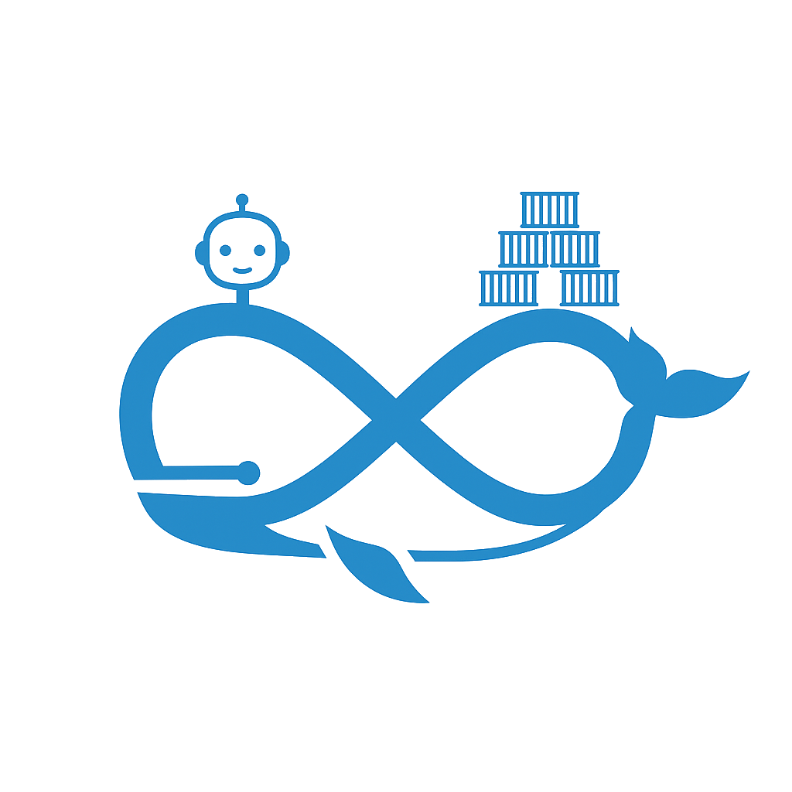

# docker-ai: Your Command-Line AI Assistant for Docker

**`docker-ai` is an experimental command-line tool that brings the power of generative AI to your Docker workflow.**

Instead of memorizing complex Docker commands, you can simply tell `docker-ai` what you want to do in plain English. The tool interacts with an LLM to translate your request into the correct Docker command and executes it for you.

  <picture>
    <source media="(prefers-color-scheme: dark)" srcset="assets/logo-dark.png">
    <source media="(prefers-color-scheme: light)" srcset="assets/logo-light.png">
    
  </picture>

  <em>A demonstration of using docker-ai to find and delete a Docker image.</em>

  

## How It Works

1.  **You talk, it listens**: You provide a prompt in natural language (e.g., "delete all unused images").
2.  **AI translates**: `docker-ai` sends this prompt to an LLM (like OpenAI's GPT models or Google's Gemini), which generates the corresponding Docker command.
3.  **You approve**: The tool shows you the generated command and asks for your confirmation before running it.
4.  **It executes**: Once you approve, `docker-ai` runs the command and displays the output.

This approach combines the flexibility of natural language with the power and precision of the Docker CLI, making it easier than ever to manage your containers. 